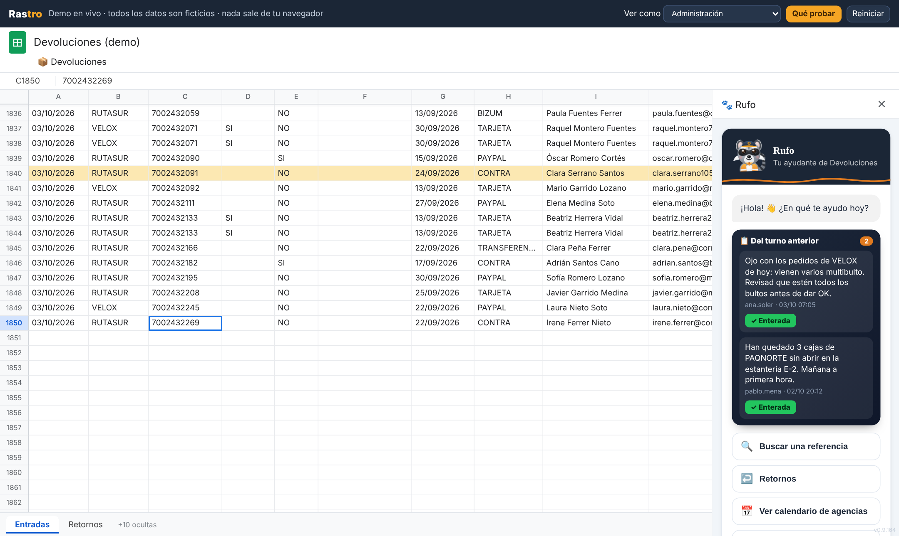
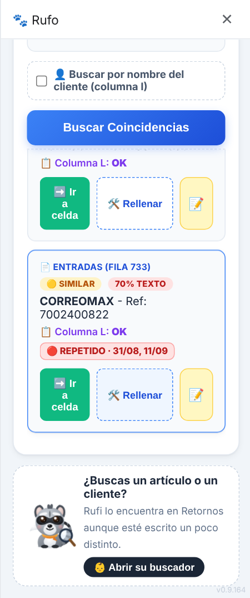
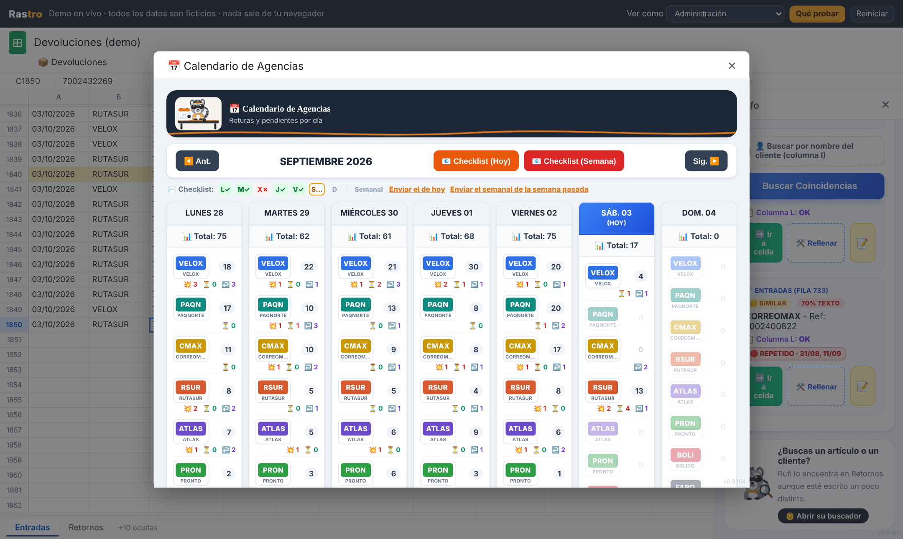
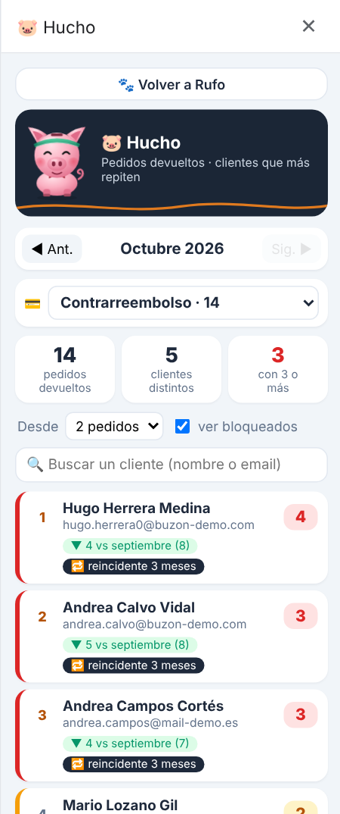

# Rastro · auditoría de devoluciones en Google Sheets

**[▶ Probar la demo en vivo](https://francisykza.github.io/rastro/)** · datos ficticios · funciona en el navegador, sin cuenta de Google

Rastro es el sistema que diseñé y mantengo para el equipo de devoluciones de un almacén de comercio electrónico. Está hecho en **Google Apps Script** sobre una hoja de cálculo compartida con más de 60.000 filas, y lo usa el equipo a diario: cada bulto que llega se escanea, se revisa y se registra aquí.

Esta es la versión pública: los nombres, correos, agencias y datos son inventados. La herramienta real lleva más de 200 correcciones en producción.

## El problema

El equipo trabajaba directamente sobre una hoja enorme y compartida: sin saber qué se había hecho en cada turno, sin recuento fiable por agencia de transporte, buscando pedidos con Ctrl+F y redactando a mano el resumen diario para la jefatura.

## Qué hace

- **Registro automático** de todo lo que se escribe en la hoja (agencia, roturas, verificación), con historiales propios y sin contar nada dos veces, aunque se pegue, se arrastre o se edite a la vez.
- **Buscador de pedidos** tolerante a errores de tecleo (distancia de Levenshtein), con aviso de **multibulto** y **repetido**, y relleno rápido de la fila sin salir del panel.
- **Calendario por agencia**: traído, roto, pendiente por abrir y retornos de cada día, con el **checklist diario y semanal** preparado para pegar en Outlook.
- **Retornos**: búsqueda aproximada de clientes y artículos, relleno guiado y **historial de cambios** con restauración.
- **Recuento por turnos**, notas entre turnos y un **ranking mensual** de clientes que más devuelven (Hucho).
- **Control de acceso** por correo, opciones solo para administración y mensaje propio para quien no tiene permiso.
- **Rufo**, un asistente animado en la barra lateral: duerme, se despierta, se rasca la cabeza mientras busca y celebra cuando encuentra el pedido.

| Buscar (también parecidas) | Calendario de agencias | Ranking mensual |
|---|---|---|
|  |  |  |

## Decisiones técnicas

- **El límite de 30 s de los activadores simples.** `onEdit` se corta a los 30 s, y en una hoja de 60.000 filas eso pasaba. Cada edición tiene un presupuesto de tiempo; lo que no cabe se aplaza y lo recoge una **revisión automática cada 5 minutos**, que compara una «foto» de las últimas filas y añade o quita los registros que falten.
- **Escrituras concurrentes.** Varias personas editan a la vez: los historiales se escriben con bloqueo del documento y, si no se consigue, con `appendRow`, que es atómico.
- **Rendimiento.** Lecturas acotadas (solo las columnas y el bloque de filas necesarios), búsqueda primero en las filas recientes y con el buscador interno de Google, cachés en el navegador con renovación en segundo plano, y **el mismo código de búsqueda del servidor copiado al panel** (verificado antes de usarlo) para que Retornos responda en unos 40 ms.
- **Historiales que no salen con Ctrl+F.** Las referencias se guardan codificadas con caracteres de uso privado.
- **Restricciones de Apps Script.** `Session.getActiveUser()` viene vacío con cuentas de otro dominio (se recuerda la identificación por cuenta); `google.script.run` no llama a funciones con `_`; el HTML de los paneles vive en una plantilla con comillas invertidas.
- **Correo que llegue.** El correo automático no pasaba el filtro de la empresa, así que el checklist se prepara como tabla HTML pensada para Outlook y se pega con Ctrl+V.

## Cómo está hecha la demo

La demo ejecuta **el código real del sistema** en el navegador. Debajo hay una simulación propia de los servicios de Google que usa (hoja de cálculo, propiedades, caché, bloqueos, menús, plantillas HTML, barra lateral y `google.script.run`), con una hoja de datos ficticios que se genera al abrir la página. Al escribir en una celda salta `onEdit`, igual que en Google Sheets.

## Stack

Google Apps Script · Google Sheets · HTML/CSS/JavaScript (sin librerías) · SVG animado con CSS

## Autoría y derechos

© 2026 Francisco Muñoz Dorado. Todos los derechos reservados. El código de este repositorio se publica solo para que se pueda ver y probar la demo; no se permite copiarlo, modificarlo ni reutilizarlo. Ver [LICENCIA](LICENCIA.md).
